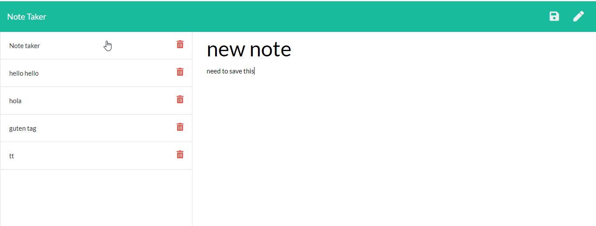

# noteTaker
# about the app
For this homework assignment I created an application that can be used to write, save, and delete notes. This application uses an express backend to save and retrieve note data from a JSON file.

## User Story
With this app, users are able to write, save notes, and delete notes
They can organize their thoughts and keep track of tasks they need to complete

### Business Context
For users that need to keep track of a lot of information, it's easy to forget or be unable to recall something important. Being able to take persistent notes allows users to have written information available when needed.

